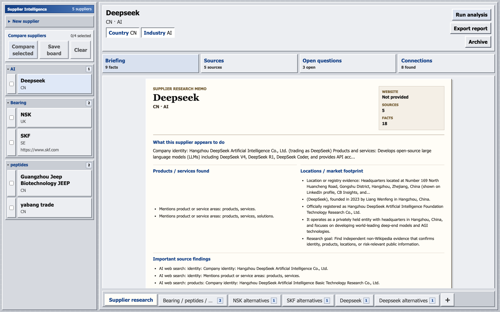
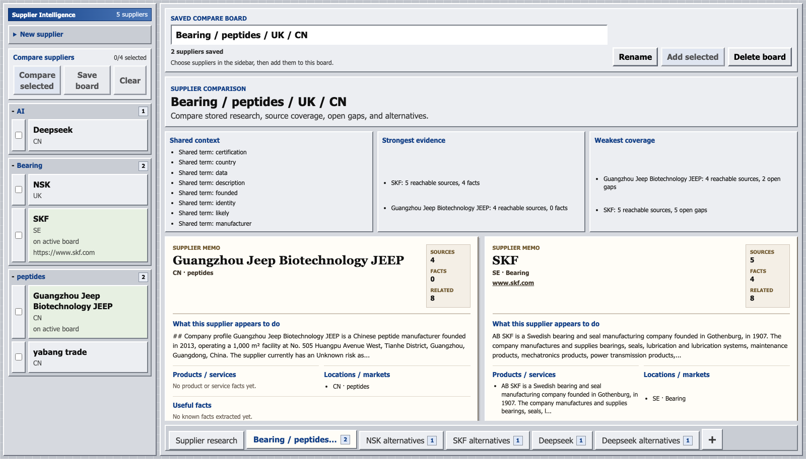

# Supplier Intelligence

Supplier Intelligence is a local supplier research workspace built with ASP.NET Core, EF Core, SQLite, React, and OpenRouter.

It helps collect supplier evidence, turn that evidence into a readable briefing, track open questions, discover related suppliers, and compare suppliers in saved board-style workspaces.


## Screenshots

### Supplier Briefing



### Saved Compare Boards



## What It Does

- Create supplier profiles with name, country, industry, and optional website.
- Run background supplier research from the C# API.
- Store source checks, public evidence, extracted facts, and research notes.
- Generate a letter-style supplier briefing for quick understanding.
- Track open questions that still need evidence.
- Show related suppliers and possible alternatives.
- Save supplier comparison boards with Excel-style bottom tabs.
- Export supplier research as Markdown.
- Configure an OpenRouter runtime key inside the app without committing secrets.

## Product Flow

```text
Supplier -> Sources -> Facts -> Briefing -> Open Questions -> Connections -> Compare Boards -> Report
```

The main screen is intentionally split into two layers:

- `Supplier research`: understand one supplier quickly.
- `Compare boards`: save groups of suppliers and compare them side by side.

## Tech Stack

| Layer | Technology |
| --- | --- |
| API | ASP.NET Core Web API |
| Data | Entity Framework Core + SQLite |
| Worker logic | C# background services |
| Frontend | React + Vite + TypeScript |
| AI provider | OpenRouter |
| Reports | Markdown export |

## Local Setup

Start the API:

```bash
cd src/SupplierIntelligence.Api
dotnet run --urls http://127.0.0.1:5142
```

Start the frontend:

```bash
cd src/SupplierIntelligence.Web
npm install
npm run dev
```

Open the local URL printed by Vite, usually:

```text
http://127.0.0.1:5173
```

If that port is busy, Vite may use another port such as `5174`.

## OpenRouter Setup

The app uses a runtime key field instead of storing API keys in source control.

1. Start the C# API.
2. Open the frontend.
3. Go to the supplier workspace and expand `Technical details`.
4. Paste an OpenRouter key into `OpenRouter API key`.
5. Click `Save key for this run`.
6. Click `Test connection`.
7. Run the supplier analysis after the test succeeds.

The key is held only in backend memory for the current API process. Restarting the API clears it.

## Current Features

| Feature | Status |
| --- | --- |
| Supplier CRUD | Working |
| Sidebar industry folders | Working |
| Background analysis jobs | Working |
| Source collection and editing | Working |
| Website research ingestion | Working |
| Supplier fact extraction | Working |
| Letter-style briefing | Working |
| Open question review | Working |
| Supplier connections | Working |
| Saved compare boards | Working |
| Markdown report export | Working |
| Runtime OpenRouter key management | Working |

## C# Learning Goals

This started as a C# learning project. The codebase is useful for practicing:

- Request/response DTOs
- Minimal API endpoints
- Entity Framework Core models and relationships
- SQLite schema initialization
- Background workers
- Dependency injection
- Service boundaries
- API-to-React contracts
- Error handling around external AI providers

The learning roadmap is included as:

```text
csharp-learning-tldr.excalidraw
```

## Repository Notes

Do not commit local runtime data or secrets:

- `*.db`
- `.env`
- `node_modules/`
- `bin/`
- `obj/`
- `dist/`
- OpenRouter API keys

## Status

This is a learning/demo application, not a production supplier-risk system.
