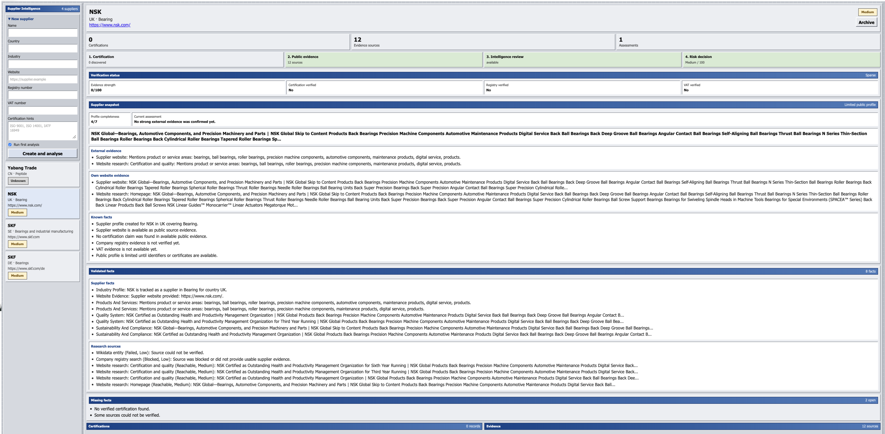
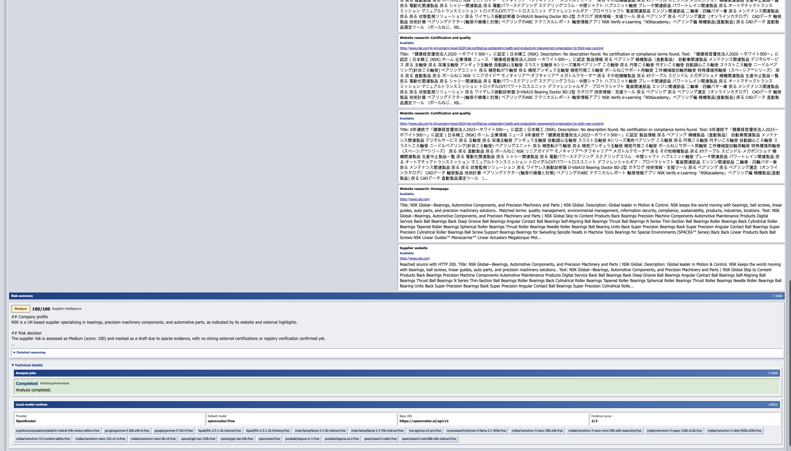
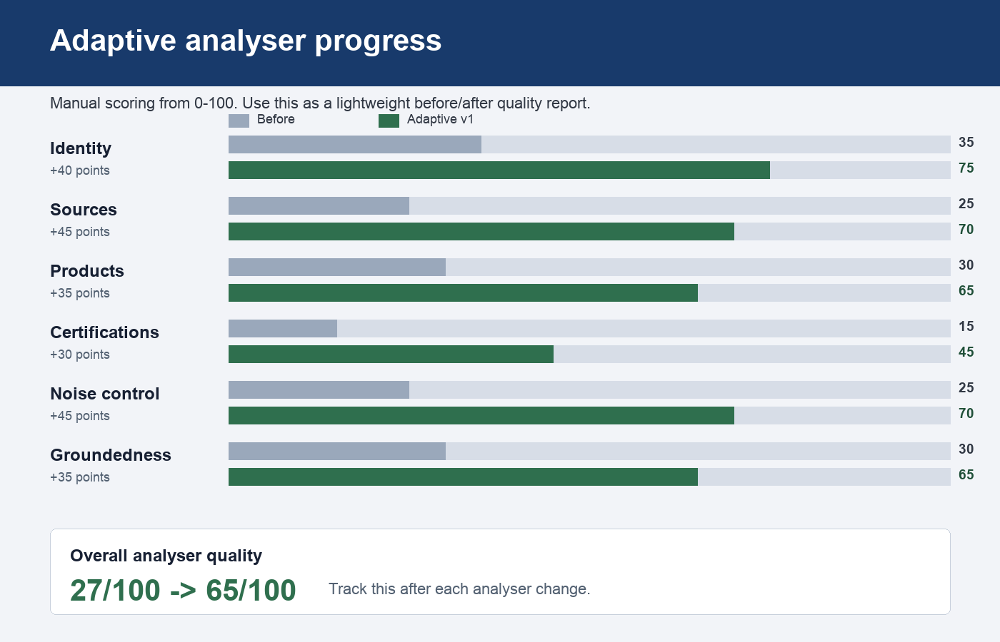

# Supplier Intelligence

C# learning project for supplier intelligence workflows.

The app combines an ASP.NET Core Web API, EF Core, SQLite, a React frontend, and optional AI-assisted web research. It is designed as a simplified training app for understanding how C# backend components, database entities, API contracts, background jobs, and frontend views work together.

## What It Does

- Creates supplier profiles with name, country, industry, and optional website.
- Runs automated supplier analysis in the background.
- Checks public evidence sources and supplier websites.
- Extracts structured supplier facts from available evidence.
- Generates supplier risk summaries with OpenRouter.
- Shows evidence, missing facts, analysis history, and supplier facts in a compact UI.

## Tech Stack

- ASP.NET Core Web API
- Entity Framework Core
- SQLite for local development
- React and Vite
- OpenRouter for model generation and optional web search

## Learning Map

The C# learning roadmap is included as:

```text
csharp-learning-tldr.excalidraw
```

It summarizes the main C# concepts used in this project.

## Local Setup

Start the API:

```bash
cd src/SupplierIntelligence.Api
dotnet run --urls http://127.0.0.1:5142
```

Start the frontend:

```bash
cd src/SupplierIntelligence.Web
npm install
npm run dev
```

Open:

```text
http://127.0.0.1:5174
```

## OpenRouter Setup

Use environment variables. Do not commit API keys.

```bash
unset LocalModel__ApiKey
export OPENROUTER_API_KEY="your_key_here"
export LocalModel__Provider="OpenRouter"
export LocalModel__Model="openrouter/free"
export LocalModel__EnableWebSearch="true"
dotnet run --urls http://127.0.0.1:5142
```

## Repository Notes

The repository intentionally excludes local databases, build outputs, environment files, and temporary tooling folders.

Do not commit:

- `*.db`
- `.env`
- `node_modules/`
- `bin/`
- `obj/`
- `dist/`
- local API keys

## Status

This is a learning/demo application, not a production supplier-risk system.


## Dashboard




## Analyser Quality


